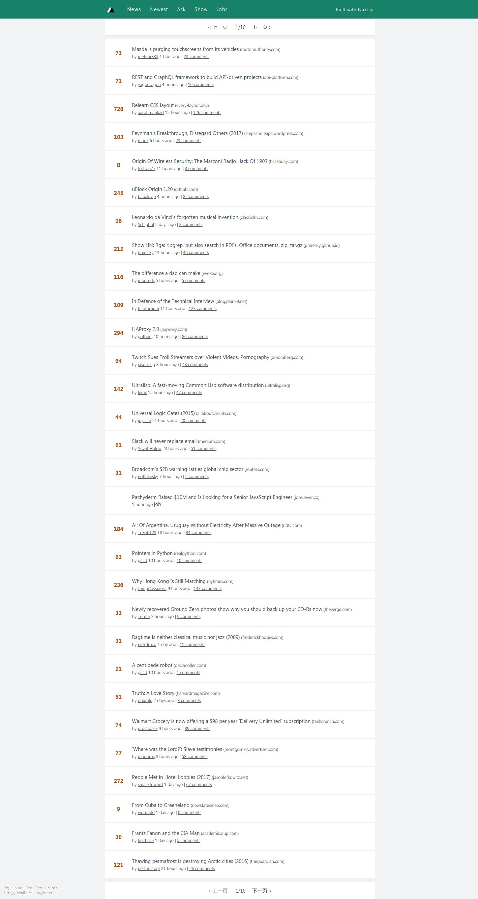

# vue2-nuxt-start

> Nuxt.js 项目,仅供学习使用

## 截图



## 构建项目

``` bash
vue init nuxt-community/starter-template vue2-nuxt-start
#创建项目

# 安装依赖
$ npm install # 或者使用 yarn 安装

# 本地服务器热重载 localhost:3000
$ npm run dev

# 构建到生产并运行服务器
$ npm run build
$ npm start

# 生成静态页面
$ npm run generate
```

## 依赖

```bash
nuxt
#服务端渲染库

@nuxtjs/axios
#axio与nuxt集成库

@nuxtjs/component-cache
#vue-server-renderer内置的支持级缓存。 这个模块自动添加一个LRU缓存的项目

@nuxtjs/pwa
#Supercharge Nuxt具有经过严格测试，更新且稳定的PWA解决方案

apicache
#用于Express / Node的简单API缓存中间件。

express
#node框架

nuxt-edge
#使用nuxt-edge试验最新功能,使用它不能使用nuxt

prettier
# Prettier 作为代码格式化工具，能够统一你或者你的团队的代码风格。

eslint-config-prettier
#关闭所有不必要的规则或者可能与Prettier冲突的规则。

eslint-plugin-prettier
#将美化者作为ESLint规则运行，并将差异报告为单个ESLint问题。
```

有关如何工作的详细说明，请查看 [Nuxt.js docs](https://github.com/nuxt/nuxt.js).

## 打包

如果我们在另外一个页面内也引用了 `axios` ，那么在应用打包发布的时候 `axios` 会被打包两次，而实际上我们只需要打包一次。这个问题可以通过在 `nuxt.config.js` 里面配置 `build.vendor` 来解决

```JavaScript
module.exports = {
  build: {
    vendor: ['axios']
  }
}
```

## 相关链接

[hackernews-nuxt](https://github.com/nuxt/hackernews)
